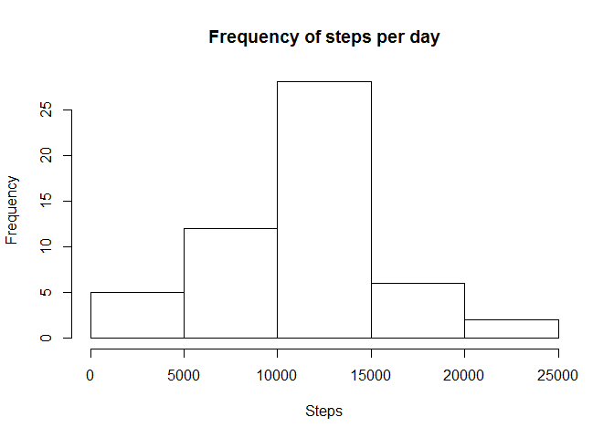

# Reproducible Research: Peer Assessment 1


## Loading and preprocessing the data

Load from the source, unzip the file and create a dataframe called activity  
Then convert char class of date variable by POSIXct / POSIXt class  


```r
temp <- tempfile()
download.file("https://d396qusza40orc.cloudfront.net/repdata%2Fdata%2Factivity.zip",temp)
zipsource <- unz(temp, "activity.csv")
activity<-read.csv(zipsource, na.strings = "NA")
unlink(temp)
activity<-transform(activity,date=as.POSIXct(activity$date))
```

## What is the mean of the total number of steps taken per day?

### Calculate the total number of steps taken per day

```r
stepsperday<-aggregate(activity$steps,by=list(activity$date),sum)
```

### Histogram of the total number of steps per day
The majority steps per day for this period fall in between 10000 and 15000


```r
hist(stepsperday$x,main="Frequency of steps per day",xlab="Steps")
```

 

### For the calculation of the mean per day we ignore missing values in the dataset
We take the sum of stepsperday variable and calculate the mean and median 

```r
stepsperday_mean<-mean(stepsperday$x,na.rm=T)
stepsperday_mean
```

```
## [1] 10766.19
```

```r
stepsperday_median<-median(stepsperday$x,na.rm=T)
stepsperday_median
```

```
## [1] 10765
```

## What is the average daily activity pattern?
###  5 minute interval and the average number of steps taken, avreaged across all days (y-axis)
Convert interval variable to a factor  
Calculate average steps by Intervalfactor group  
Rename variables  
Plot result of mean from steps by interval group  


```r
activity<-transform(activity,intervalfactor=as.factor(activity$interval))
stepsbyinterval_mean<-aggregate(activity$steps,by=list(activity$intervalfactor), mean, na.rm=T)
names(stepsbyinterval_mean)<-c("intervalfactor","stepsmean")
par(mfrow=c(1,1))
plot(stepsbyinterval_mean$stepsmean,ylab="Average Steps",xlab="Intervals",type="l")
```

 

### Which 5 minutes interval, on average across all datasets contains the maximum number of steps? See result below.

```r
maxstepsinterval <- activity$interval[which.max(stepsbyinterval_mean$stepsmean)]
maxstepsinterval
```

```
## [1] 835
```


## Imputing missing values
### Calculating and report the total number of missing values in the dataset (i.e. the total number of rows with NAs)


```r
sum(is.na(activity$steps))
```

```
## [1] 2304
```

### Devising a strategy for filling in all of the missing steps values in the dataset. Using the mean for that 5-minute interval across days (stepsbyinterval_mean)
Take 1) activity- and 2) stepsbyinterval_mean dataframes and merge them together to create a new dataset  
Where steps has NA values assign stepsmean  


```r
newdataset <- merge(activity, stepsbyinterval_mean, by="intervalfactor")
newdataset$steps[is.na(newdataset$steps)]<-newdataset$stepsmean[is.na(newdataset$steps)]
```

Create a new histogram of total number of steps taken and calculate and report mean and median of total number of steps taken per day.


```r
stepsperday_sum2<-aggregate(newdataset$steps,by=list(newdataset$date),sum)
hist(stepsperday_sum2$x,main="Frequency of steps per day",xlab="Steps")
```

 

```r
stepsperday_mean2<-mean(stepsperday_sum2$x,na.rm=T)
stepsperday_mean2
```

```
## [1] 10766.19
```

```r
stepsperday_median2<-median(stepsperday_sum2$x,na.rm=T)
stepsperday_median2
```

```
## [1] 10766.19
```

Values vary from first part as NA values have been replaced. Mean and median are closer together.  

## Are there differences in activity patterns between weekdays and weekends?
###Create a new factor variable in the dataset with two levels - "weekday" and "weekend" indicating whether a given date is a weekday or weekend day.
Assign condition to set weekends and weekday value on the basis of calculated weekdays value  


```r
newdataset$day <- weekdays(newdataset$date)
newdataset$day[newdataset$day == "Saturday" | newdataset$day == "Saturday" ] <- "weekend"
newdataset$day[newdataset$day == "Monday" | newdataset$day == "Tuesday" | newdataset$day == "Wednesday"| newdataset$day == "Thursday" | newdataset$day == "Friday" ] <- "weekday"
```

###Make a panel plot containing a time series plot (i.e. type = "l") of the 5-minute interval (x-axis) and the average number of steps taken, averaged across all weekday days or weekend days (y-axis).

Calculate the average steps in each 5 minute interval for weekdays and weekends.  


```r
stepsbyinterval_weekday_average =  tapply(subset(newdataset, day=="weekday")$steps, subset(newdataset, day=="weekday")$interval, mean, na.rm=TRUE)
stepsbyinterval_weekend_average =  tapply(subset(newdataset, day=="weekend")$steps, subset(newdataset, day=="weekend")$interval, mean, na.rm=TRUE)
```

Plot results by creating a two panel output  

```r
par(mfrow = c(2, 1))
plot(stepsbyinterval_weekday_average, type="l", xlab="5 minutes interval", ylab="Average number of steps", main="weekdays")
plot(stepsbyinterval_weekend_average, type="l", xlab="5 minutes interval", ylab="Average number of steps", main="weekend")
```

 


Similar tendency in weekdays and weekend patterns, but higher values for weekends from 5-min intervals in between 120 to 250.
